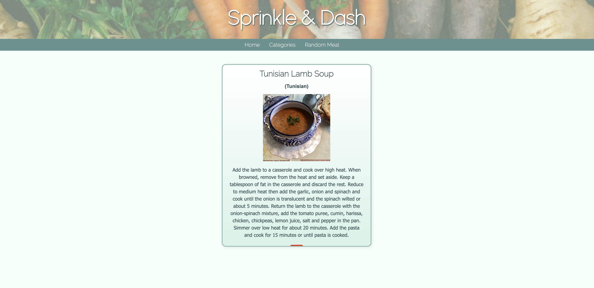
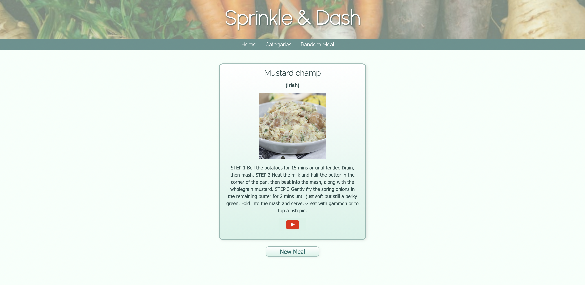

# Sprinkle & Dash

Sprinkle and Dash is a meal generator app designed with working families and people in mind, and a goal of making dinner and meal decisions simple and easy. This app uses themealdb API to pull meals and recipes from a database and share them with the user. You can narrow down meal choices via the Categories link in the navigation, or select a random meal via the Random Meal link that is also in the navigation.

#### Homepage

#### Categories

#### Category Meals

#### Recipe (from category meals)

#### Random Meal

---

> **Technologies Used:**
>
> - This app was created using **React**, minimal **HTML5**, as well as the bulk of the styling coming from **CSS**.
> - **React** was used to render all components/pages in the app, as well as create all the functionality of the buttons and links. React was also used to filter in the information from an outside API.
> - **CSS** was used for styling, including all of the image sizing, placement of containers, and the fonts, color, and flex attributes.
> - **HTML** was used to create the containers and text for all text and image elements on the page.
> - An **API** was used for the recipe and meal information. This API can be found at _themealdb.com_. This API was used to pull images, recipes, origins, and video links.

---

### Installation Instructions

If you would like to work through this code yourself, it is a public project that is available for you to fork and clone for your own personal use or enlightenment.

Simply fork this repository to your own account, copy the link, and clone it down using your computer's terminal.

---

### Contribution Guidelines

As mentioned above, if you would like to work on this code yourself, it is public and available for your use.

**Ideal contributions and improvements would include:**

- A functional searchbar so that users can search for recipes by ingredients and categories instead of having to follow links to the respective pages.
- Account creation for user to be able to create their own collection. This would include a sign-up page that would host their login and account information. Part of this would also be the ability for the user to save the recipes they've tried and liked for later use.
- The addition of measurements on each recipe.
- Styling improvement and enhancements -- especially those that contribute to responsive design.
